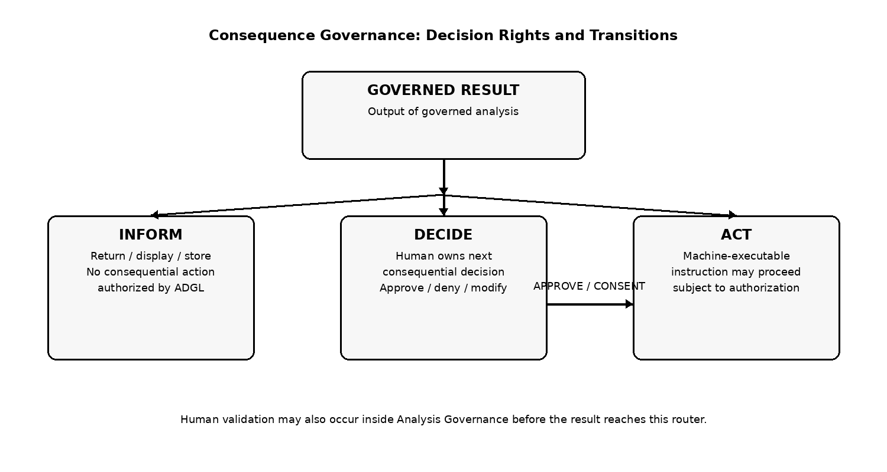

**GBSN Research**

Lisbon, Portugal \| Contact: www.gbsnresearch.com — use Contacts

*Normative/technical companion to ADGL Main Paper v0.9*

# B.1 ARCHITECTURAL PRINCIPLE

ADGL defines three governance stages and one cross-cutting audit/provenance plane. The stages answer different questions and MUST remain conceptually separable even if an implementation fuses them for performance.

Fig. B-1. Three-stage architecture.

# B.2 KNOWLEDGE GOVERNANCE

Question: What knowledge may be considered, and in what capacity? Knowledge Governance controls candidate admission and influence before analytical computation.

| **Family**     | **Representative semantics**                                                          |
|----------------|---------------------------------------------------------------------------------------|
| Admission      | ALLOW, DENY, EXCLUDE, REQUIRE                                                         |
| Influence      | PRIORITIZE, DEPRIORITIZE, DEFER_TO, ASSIGN_ROLE, REQUIRE_CORROBORATION                |
| Lifecycle      | QUARANTINE, EMBARGO, ISOLATE, RELEASE, SUPERSEDE, EXPIRE, REVOKE, ARCHIVE             |
| Provenance     | TRACE, VERIFY_SOURCE, REQUIRE_PROVENANCE, DERIVES_FROM propagation                    |
| Evidence roles | GOVERNING, PRIMARY, CORROBORATING, SUPPLEMENTARY, CONTEXTUAL, CONTRADICTORY, EXCLUDED |

Selection is not admission. Retrieval relevance MUST NOT by itself establish permission to influence Analysis. Authority, priority, applicability, and evidence role MUST remain independently representable.

# B.3 ANALYSIS GOVERNANCE

Question: What analytical computation may be performed on admissible knowledge? Analysis Governance governs method, model, tools, inference, transformation, evidence sufficiency, validation, and processing environment.

| **Control family**    | **Examples**                                                                                        |
|-----------------------|-----------------------------------------------------------------------------------------------------|
| Method                | COMPARE, CLASSIFY, SUMMARIZE, CALCULATE, SCORE, ESTIMATE, INFER, VERIFY                             |
| Transformation        | FILTER, SAMPLE, GROUP, AGGREGATE, NORMALIZE, WEIGHT, BALANCE                                        |
| Evidence constraints  | REQUIRE_CORROBORATION, REQUIRE_SECOND_SOURCE, PRESERVE_CONFLICT                                     |
| Inference constraints | DO_NOT_INFER, LIMIT_INFERENCE, explicit missing-value rules                                         |
| Validation            | REQUIRE_VALIDATION, confidence thresholds, human validation, reprocess                              |
| Execution resource    | approved model/version, approved tool, approved region, customer-controlled deployment, no fallback |

Human participation at this stage is analytical validation, not consequence ownership. Example: an AI classification with confidence below a policy threshold may require a human validator before a result is eligible for consequence routing.

Model and geographic routing are primarily Analysis Governance concerns when they determine which resource may compute over governed evidence. A tool call used only to retrieve or transform evidence also remains within Analysis Governance unless it changes external business state as a consequence of the result.

# B.4 CONSEQUENCE GOVERNANCE

At a given consequence decision point, one primary disposition is selected. Auxiliary notifications or logging may occur without changing that primary disposition. Subsequent governed cycles may select a different disposition, and DECIDE may transition to ACT after an authorized human decision.

Question: What is the governed AnalysisResult permitted to cause? Consequence Governance separates information from decision rights and machine execution.

| **Disposition** | **Meaning**                                                              | **Typical next step**                                              |
|-----------------|--------------------------------------------------------------------------|--------------------------------------------------------------------|
| INFORM          | The governed result is the authorized endpoint.                          | Return, display, store, report.                                    |
| DECIDE          | A human/accountable role owns the next consequential choice.             | Approve, deny, modify, consent, request evidence, defer, escalate. |
| ACT             | A machine-executable side effect is authorized subject to action policy. | API/tool/workflow/database/message or other external state change. |

Fig. B-2. Consequence dispositions and DECIDE-to-ACT transition.

# B.5 DECISION RIGHTS AND HUMAN GOVERNANCE

DECIDE MUST identify a decision owner or resolvable role where organizational accountability requires it. Human decisions MAY include APPROVE, DENY, MODIFY, CONSENT, REQUEST_EVIDENCE, DEFER, and ESCALATE. Human validation inside Analysis Governance and human decision ownership inside Consequence Governance are different semantics and SHOULD be audited separately.

# B.6 MACHINE ACTION AND AGENTIC EXECUTION

ACT is technology-neutral. The executor may be an AI agent, API client, workflow system, webhook, deterministic service, or other software. Agentic execution is therefore a consequential specialization of ACT rather than the basis of ADGL. Action authorization MAY include action type, target, Case, purpose, capability grant, expiration, maximum calls, maximum value, data-volume limits, reversibility, redelegation, and rate limits.

ADGL policy does not physically enforce a sandbox, firewall, API gateway, or IAM control. External enforcement adapters MUST implement the decision at the relevant boundary. An implementation MUST NOT claim that semantic controls such as LOCAL_ONLY or NO_FALLBACK alone prevent sandbox escape.

# B.7 AUDIT AND PROVENANCE PLANE

Audit records every stage rather than only the final result. Knowledge events record candidate and disposition state. Analysis events record method, executor, transformation, validation, thresholds, conflicts, and result. Consequence events record INFORM/DECIDE/ACT routing, decision-right ownership, human choices, capability grants, action authorization, external result references, and resulting state. Audit MAY be exported to existing SIEM, logging, provenance, or governance systems.

# B.8 FEEDBACK LOOPS

Fig. B-3. Feedback loops.

Analytical retrieval can create new candidate knowledge, which re-enters Knowledge Governance. Stored analysis outputs become derived KnowledgeObjects and MUST carry appropriate provenance/restrictions. ACT outcomes may also create new facts. Autonomous or iterative systems therefore execute repeated governed cycles rather than escaping the three-stage model.

# B.9 STAGE-SPECIFIC CONFORMANCE

Knowledge-stage conformance includes admission/lifecycle/evidence semantics. Analysis-stage conformance includes method allowlists, evidence sufficiency, inference constraints, validation gates, model/region restrictions, and conflict preservation. Consequence-stage conformance includes correct INFORM/DECIDE/ACT routing, decision-right assignment, action authorization, DECIDE-to-ACT transitions, and end-to-end audit coverage.
