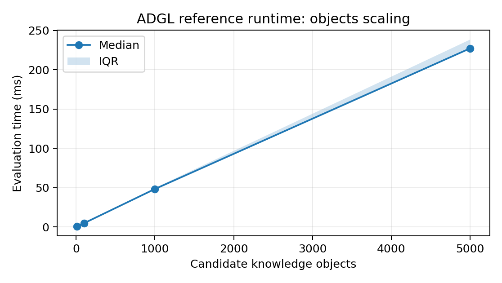
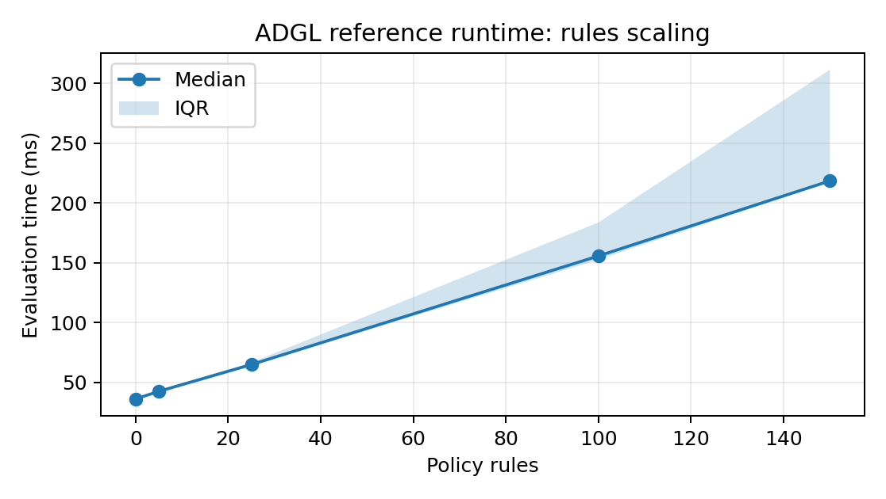

GBSN Research

Lisbon, Portugal \| Contact: www.gbsnresearch.com — use Contacts

Reference Toolkit 0.5.0 \| Research Release 0.4.0

# D.1 PURPOSE AND SCOPE

The ADGL Reference Toolkit is an executable research artifact, not a production governance service. It implements deterministic semantics sufficient to inspect, test, and falsify the proposed architecture. It contains no foundation model and performs no live enterprise action.

# D.2 REPOSITORY STRUCTURE

adgl/ core engine, pipeline engine, analysis, consequence, audit  
schemas/ core/pipeline policy, knowledge, model, analysis-result, action, grant, profile  
examples/ eight reference cases  
profiles/ illustrative non-normative domain profiles  
conformance/ executable results  
benchmarks/ reproducible benchmark harness and results  
docs/ semantics, profiles, threat model, implementation status  
tests/ automated software tests

# D.3 IMPLEMENTATION STATUS

| **Capability**                               | **Status**                                                    |
|----------------------------------------------|---------------------------------------------------------------|
| Knowledge admission/lifecycle/evidence roles | Implemented core subset                                       |
| Authority/priority/applicability             | Implemented core subset                                       |
| Derived restriction propagation              | Implemented basic propagation                                 |
| Model/processing-region eligibility          | Implemented                                                   |
| Deterministic base policy composition        | Implemented                                                   |
| Analysis method allowlist                    | Implemented                                                   |
| Corroboration/evidence sufficiency           | Implemented                                                   |
| No-infer-missing                             | Implemented                                                   |
| Human validation inside Analysis             | Implemented basic gate                                        |
| INFORM / DECIDE / ACT                        | Implemented                                                   |
| DECIDE -\> ACT                               | Implemented                                                   |
| Capability-grant action authorization        | Implemented basic action/case/value/expiry checks             |
| Live API/tool enforcement                    | Not implemented; external integration                         |
| Production IAM/workflow/sandbox              | Not implemented; external enforcement                         |
| Full independent implementation portability  | Not yet established                                           |
| Three-stage pipeline policy validation       | Implemented schema + embedded core validation                 |
| Stage-qualified analytical transformations   | Partial; legacy collection operations retained in core engine |
| Pipeline-native model/region stage placement | Partial; core-compatible routing reused                       |

# D.4 CONFORMANCE RESULTS

The packaged software test suite reports 10/10 passing tests. The normative/reference conformance runner reports 25/25 passing checks.

| **Check**                            | **Result** |
|--------------------------------------|------------|
| C01 Exclusion safety                 | PASS       |
| C02 Quarantine isolation             | PASS       |
| C03 Embargo enforcement              | PASS       |
| C04 Supersession                     | PASS       |
| C05 Priority/authority separation    | PASS       |
| C06 Applicability gating             | PASS       |
| C07 Model eligibility                | PASS       |
| C08 Region safety                    | PASS       |
| C09 Fallback safety                  | PASS       |
| C10 Mandatory evidence               | PASS       |
| C11 Conflict preservation            | PASS       |
| C12 Derived restriction propagation  | PASS       |
| C13 Audit completeness               | PASS       |
| C14 Deterministic replay             | PASS       |
| C15 Portable-subset equivalence      | PASS       |
| C16 Deterministic policy composition | PASS       |
| C17 Analysis method governance       | PASS       |
| C18 No-infer-missing                 | PASS       |
| C19 Analysis corroboration gate      | PASS       |
| C20 INFORM disposition               | PASS       |
| C21 DECIDE disposition               | PASS       |
| C22 ACT capability authorization     | PASS       |
| C23 DECIDE-to-ACT transition         | PASS       |
| C24 End-to-end audit stage coverage  | PASS       |
| C25 Task-scoped action grant         | PASS       |

# D.5 CORE RUNTIME BENCHMARK

The benchmark measures only deterministic governance-engine overhead. It excludes retrieval, model inference, network latency, connector I/O, token generation, external persistence, and execution of real actions. Smaller workloads use 20 measured runs after warmup; the largest 5,000-object and 150-rule workloads use 12 measured runs. Median and interquartile range (IQR) are used as the primary descriptive statistics.

| **Objects** | **Rules** | **Runs** | **Median ms** | **IQR ms** |
|-------------|-----------|----------|---------------|------------|
| 10          | 10        | 20       | 0.60          | 0.02       |
| 100         | 10        | 20       | 4.79          | 0.16       |
| 1000        | 10        | 20       | 48.35         | 2.31       |
| 5000        | 10        | 12       | 227.29        | 12.03      |

Fig. D-1. Object-scaling benchmark.

| **Objects** | **Rules** | **Runs** | **Median ms** | **IQR ms** |
|-------------|-----------|----------|---------------|------------|
| 1000        | 0         | 20       | 36.10         | 0.85       |
| 1000        | 5         | 20       | 42.46         | 1.79       |
| 1000        | 25        | 20       | 64.85         | 2.61       |
| 1000        | 100       | 20       | 155.75        | 31.22      |
| 1000        | 150       | 12       | 218.54        | 93.80      |

Fig. D-2. Rule-scaling benchmark.

# D.6 THREE-STAGE PIPELINE BENCHMARK

A second microbenchmark executes the three-stage reference pipeline over 1,000 objects for INFORM, DECIDE, and ACT routing. The benchmark stops at the governance decision and does not execute an external human workflow or API action. It is a warmed single-process microbenchmark and is reported with median/IQR only.

| **Disposition** | **Objects** | **Runs** | **Median ms** | **IQR ms** |
|-----------------|-------------|----------|---------------|------------|
| INFORM          | 1000        | 20       | 55.74         | 3.00       |
| DECIDE          | 1000        | 20       | 57.59         | 7.24       |
| ACT             | 1000        | 20       | 55.07         | 3.11       |

The three dispositions have similar governance-decision cost in this reference implementation because object-policy evaluation dominates the measured workload. This should not be interpreted as evidence that real-world human review or machine action has equivalent end-to-end latency.

# D.7 REPRODUCIBILITY

python -m pip install -e .  
adgl validate examples/regulatory_product_claim_review/policy.yaml  
adgl run examples/regulatory_product_claim_review/policy.yaml --input examples/regulatory_product_claim_review/input.json  
adgl pipeline examples/autonomous_machine_action/policy.yaml --input examples/autonomous_machine_action/input.json  
adgl conformance  
PYTHONPATH=. python benchmarks/benchmark.py --iterations 20  
PYTHONPATH=. python benchmarks/pipeline_benchmark.py

# D.8 INTERPRETATION LIMITS

The reference implementation demonstrates executability and internal conformance, not production readiness. C15 uses an independent mini-interpreter bundled in the same research project; it is not third-party validation. Production deployment requires stronger identity, enforcement, persistence, policy distribution, tamper resistance, observability, and security engineering. Analysis/consequence semantics, stage-qualified transformations, and pipeline-native model routing remain working-draft or future work.
