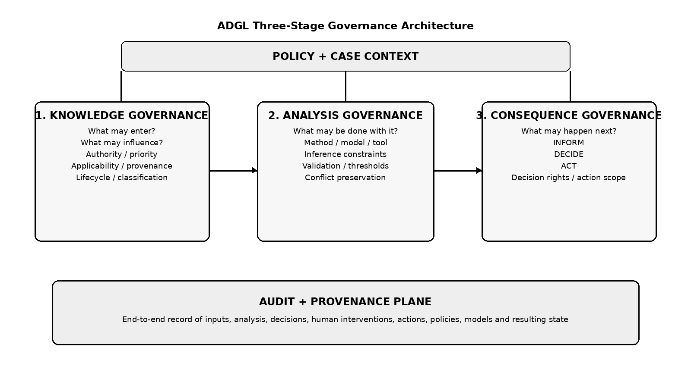
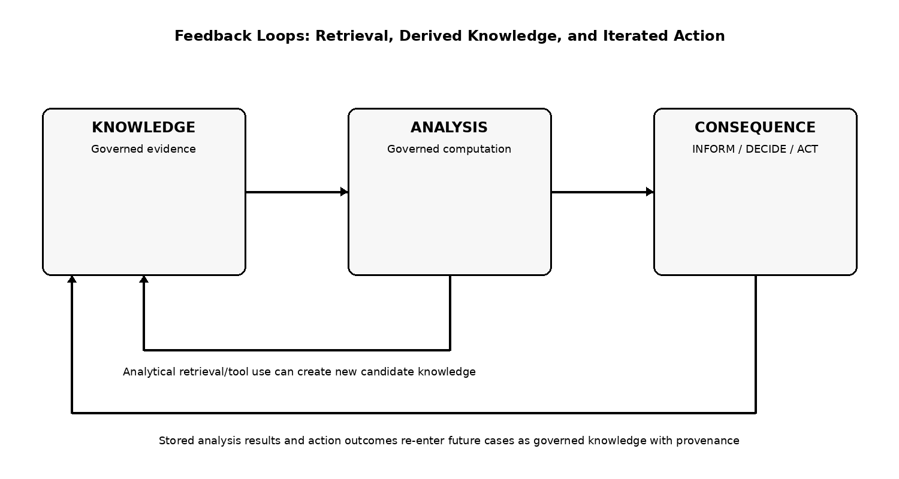

GBSN Research

Lisbon, Portugal \| Contact: www.gbsnresearch.com — use Contacts

Abstract- Artificial intelligence systems increasingly combine organizational knowledge, analytical models, tools, and automated workflows. Existing governance mechanisms address access, provenance, usage rights, organizational risk, and accountability, but they do not by themselves standardize a single AI-execution contract for three distinct questions: what knowledge may participate, what analysis may be performed on that knowledge, and what consequences a resulting analysis may produce. This paper proposes the AI Data Governance Layer (ADGL), a model-, storage-, and retrieval-agnostic policy architecture organized into Knowledge Governance, Analysis Governance, and Consequence Governance, with Audit and Provenance as a cross-cutting plane. Consequence Governance distinguishes INFORM, DECIDE, and ACT dispositions, allowing the same core architecture to support informational AI, human decision boundaries, and machine-executable outcomes without making agentic execution the default. A Python reference toolkit preserves four original knowledge-governance cases, adds four cross-stage cases, passes 25/25 executable conformance checks, and reports initial deterministic scaling measurements. ADGL is positioned as complementary to authorization, usage-control, rights-expression, provenance, interoperability, AI-management, and regulatory mechanisms rather than as a replacement for them.

Index Terms-AI governance, data governance, analysis governance, decision rights, policy-as-code, provenance, human oversight, autonomous action.

# I. INTRODUCTION

AI systems no longer merely retrieve stored data. They select evidence, transform and compare information, infer or calculate results, recommend decisions, and in some deployments trigger downstream software actions. This creates three distinct governance boundaries. First, an organization must determine which knowledge is admissible and in what evidentiary role. Second, it must determine which analytical methods, models, transformations, inference rules, validation thresholds, and processing environments are permitted. Third, it must determine what a governed result is allowed to cause: information only, a human decision boundary, or machine execution.

The distinction matters because access is not authority, admissibility is not analytical permission, and an analytical result is not automatically authorization to act. A user may be entitled to view a draft, a superseded policy, an internal study, and an applicable regulator notice. Knowledge Governance determines which may influence the case. Analysis Governance determines whether the admissible evidence may be summarized, compared, scored, inferred from, or combined, and under which validation constraints. Consequence Governance determines whether the result may simply be returned (INFORM), must be owned by a human decision maker (DECIDE), or may authorize machine execution (ACT).

The architecture preserves model, storage, retrieval, and enforcement neutrality. ADGL does not require RAG, a vector database, an AI agent, a specific policy engine, or a particular cloud. The intended contribution is a portable semantic contract that can be evaluated wherever an organization chooses to enforce it.

The paper makes six contributions: (1) a three-stage governance architecture separating knowledge, analysis, and consequence; (2) a cross-cutting audit/provenance model; (3) a consequence model based on INFORM, DECIDE, and ACT decision rights; (4) explicit support for human validation inside analysis as distinct from human decision ownership after analysis; (5) feedback semantics for derived knowledge and iterated execution; and (6) an executable reference toolkit with conformance and performance baselines.

Fig. 1. ADGL three-stage governance architecture.

# II. RELATED WORK AND ARCHITECTURAL GAP

## A. Organizational AI Governance and Regulation

NIST AI RMF organizes AI risk-management practice around GOVERN, MAP, MEASURE, and MANAGE \[1\], while its Generative AI Profile adds risk considerations specific to generative systems \[2\]. ISO/IEC 42001 specifies an organizational AI management system \[3\]. The EU AI Act imposes legal requirements in defined contexts, including data governance, logging, documentation, and human oversight for specified systems \[4\]. These mechanisms establish governance outcomes and obligations; ADGL is intended as a narrower runtime semantic layer through which an organization may implement and evidence selected controls.

## B. Authorization, Usage Control, and Rights Expression

XACML provides fine-grained authorization policy semantics and policy combining \[5\]. OPA is a general-purpose policy engine that separates policy decision-making from enforcement \[6\]. Cedar evaluates principal-action-resource-context authorization requests \[7\]. UCON extends access control with ongoing conditions, obligations, and mutable attributes \[8\]. ODRL defines permissions, prohibitions, duties, constraints, and extensible profiles for asset usage \[9\]. ADGL does not claim novelty from allow/deny policy. Its narrower standardization hypothesis is that AI systems benefit from a shared vocabulary for evidentiary role, applicability, analytical method, validation, result disposition, decision rights, and action authorization.

## C. Provenance, Retrieval, and Interoperability

W3C PROV provides a domain-independent model for entities, activities, agents, and provenance relations \[10\]. Retrieval-augmented architectures such as RAG and REALM improve access to non-parametric information \[11\], \[12\]. MCP supplies transport-level authorization and interoperability mechanisms for tool/data access \[13\]. These are complementary: provenance can feed ADGL policies, retrieval can supply candidate knowledge, and protocol authorization can enforce a transport boundary while ADGL governs what the resulting information or action means within a case.

## D. Agentic Security as an Extension, Not the Core

NIST launched an AI Agent Standards Initiative in 2026 and separately proposed work on agent identity and authorization \[14\], \[15\]. Recent security incidents also demonstrate that autonomous systems may interact with infrastructure in unanticipated ways \[16\]. ADGL treats such cases as a consequential ACT path, not as the definition of AI governance itself. Informational and human-decision use cases remain first-class.

The architectural gap addressed here is therefore not the absence of policy technologies. It is the absence of a unified, AI-execution-specific semantic chain spanning admissible knowledge, governed analytical computation, consequence disposition, and end-to-end audit across heterogeneous implementations.

# III. CONCEPTUAL ARCHITECTURE

## A. Policy and Case Context

Every execution is evaluated in a Case that binds purpose, subject, actors, jurisdiction, classification, time, organizational context, applicable policies, and other attributes. The same knowledge or analytical method may be valid in one case and invalid in another. Policy composition therefore occurs against a concrete execution context rather than as a global source ranking.

## B. Knowledge Governance

Knowledge Governance answers: what may be considered, and in what capacity? It governs admission, exclusion, quarantine, embargo, lifecycle state, source provenance, authority, contextual priority, applicability, evidence role, classification, jurisdiction, and derivative restrictions. Selection is explicitly distinct from admission: retrieval can identify a relevant object that policy still forbids from influencing analysis.

## C. Analysis Governance

Analysis Governance answers: what may be done with the admissible knowledge? It governs analytical method, model and tool eligibility, processing location, evidence sufficiency, corroboration, sampling or aggregation, inference constraints, validation thresholds, conflict preservation, explanation requirements, and reprocessing. A human may participate inside this stage as a validator when the analysis itself is not sufficiently reliable to proceed. This is distinct from a human owning a downstream decision right.

## D. Consequence Governance

Consequence Governance answers: what may happen because of the governed analysis? ADGL defines three basic dispositions. INFORM returns or stores the governed result without authorizing a consequential external action. DECIDE assigns the next consequential decision to a human or accountable role. ACT permits a machine-executable instruction subject to action authorization and external enforcement. DECIDE may transition to ACT after an authorized approval or consent.

## E. Audit and Provenance

Audit is not a fourth execution stage. It is a transversal plane that records the governance trajectory: candidate knowledge, admissions and exclusions, provenance, analysis method and model, validation events, result state, consequence disposition, human decisions, machine-action authorization, policy versions, location, and resulting state. The goal is reconstruction of governance conditions, not deterministic reproduction of probabilistic text.

Fig. 2. Consequence Governance distinguishes INFORM, DECIDE, and ACT; DECIDE may transition to ACT.

# IV. FORMAL EXECUTION MODEL

Let a Case be C=(p,s,a,j,t,c,P), containing purpose p, subject s, actors a, jurisdiction j, time t, classification/context c, and applicable policies P. Let K be the candidate knowledge set and M the available models/tools. Knowledge Governance computes an admissible, role-annotated set K\*. Analysis Governance applies a permitted analytical plan A over K\* and produces a governed result R. Consequence Governance maps R and the active Case to a consequence path O. Audit T records the full transition.

G_K(C, K) -\> K\*  
G_A(C, K\*, M, A) -\> R  
G_C(C, R) -\> O  
O in {INFORM, DECIDE, ACT}, with DECIDE -\> ACT permitted by policy  
T = Audit(C, K, K\*, A, R, O)

The functions do not imply that every implementation must execute as separate services. They define observable semantic boundaries. An optimized runtime may fuse stages if it produces equivalent decisions and audit semantics.

# V. KNOWLEDGE GOVERNANCE SEMANTICS

The knowledge model preserves the earlier ADGL separation between authority, priority, applicability, and evidence role. Authority represents the source's standing for a subject or domain. Priority is an operational preference for a case. Applicability determines whether otherwise authoritative knowledge governs the current circumstances. Evidence role indicates how the object participates: GOVERNING, PRIMARY, CORROBORATING, SUPPLEMENTARY, CONTEXTUAL, CONTRADICTORY, or EXCLUDED. These dimensions must not collapse into a single ranking score.

Lifecycle operations such as QUARANTINE, EMBARGO, SUPERSEDE, EXPIRE, and REVOKE prevent technically available objects from entering analysis when their status is incompatible with the Case. Restrictions propagate to derived knowledge unless an explicit, authorized transformation policy changes them.

# VI. ANALYSIS GOVERNANCE SEMANTICS

The addition of Analysis Governance resolves a gap in input-only governance. Two systems can receive the same admissible evidence yet reach materially different outcomes because they use different models, aggregation rules, thresholds, inference assumptions, or validation methods. ADGL therefore treats the analytical plan itself as governable.

Representative operations include COMPARE, CLASSIFY, SUMMARIZE, CALCULATE, SCORE, ESTIMATE, INFER, CORROBORATE, CHALLENGE, VERIFY, SAMPLE, AGGREGATE, NORMALIZE, and WEIGHT. Controls may require corroboration, prohibit inference over missing values, preserve contradictions, require a governing source, require explanation, impose model/version restrictions, or route low-confidence analysis to human validation.

This stage is intentionally broader than LLM reasoning. The analytical executor may be a foundation model, classical ML model, statistical routine, deterministic algorithm, human analyst, or composition of these resources. ADGL governs the analytical computation rather than the brand or architecture of the executor.

# VII. CONSEQUENCE GOVERNANCE AND DECISION RIGHTS

A governed analysis result does not itself establish authority to cause a consequential change. Consequence Governance makes that boundary explicit. INFORM is appropriate when the result is the deliverable. DECIDE is appropriate when an accountable human must own the next consequential choice. ACT is appropriate when policy authorizes machine execution, such as an API call, database write, workflow transition, message, or other external side effect.

Agentic execution is therefore a subset of ACT rather than the architecture itself. An ACT executor may be an AI agent, a workflow engine, an API client, a webhook, or ordinary software. Action authorization may be scoped by Case, capability, target, time-to-live, maximum calls, financial value, data volume, reversibility, or other constraints. Human approval can bridge DECIDE to ACT.

# VIII. FEEDBACK LOOPS AND DERIVED KNOWLEDGE

AI systems are iterative. An analytical tool call may retrieve additional information, which returns to Knowledge Governance as new candidate knowledge. Analysis can also generate conclusions that, once stored or reused, become new KnowledgeObjects and must carry provenance such as DERIVES_FROM relationships. Likewise, action outcomes may become new organizational facts. ADGL therefore models governance as a repeatable cycle rather than a one-way pipeline.

Fig. 3. Feedback loops preserve governance when retrieval, analysis results, or action outcomes create new knowledge.

# IX. REFERENCE IMPLEMENTATION AND INITIAL EVALUATION

Reference Toolkit 0.5.0 implements the original deterministic knowledge-governance subset plus a three-stage PipelineEngine. It includes 25 executable conformance checks. The first 16 cover exclusion, quarantine, embargo, supersession, authority/priority separation, applicability, model and region eligibility, fallback safety, mandatory evidence, conflict preservation, derived restriction propagation, audit completeness, deterministic replay, portable-subset equivalence, and base policy composition. Nine additional checks cover analysis-method governance, no-infer-missing, corroboration, INFORM, DECIDE, ACT authorization, DECIDE-to-ACT, cross-stage audit coverage, and task-scoped action grants.

The complete test suite passes 10/10 software tests and 25/25 conformance checks in the packaged artifact. The performance benchmark measures only the deterministic reference runtime and excludes retrieval, network, model inference, token generation, connector I/O, external action execution, and persistence. Results are reported as reproducible baselines rather than production targets.

In the object-scaling workload with 10 rules, median reference-engine latency rises from 0.60 ms at 10 candidate objects to 227.29 ms at 5,000 objects. For 1,000 objects, median latency rises from 36.10 ms at the zero-rule baseline to 218.54 ms at 150 rules, as detailed in Appendix D. Pipeline measurements over 1,000 objects show similar order-of-magnitude latency for INFORM, DECIDE, and ACT routing because the benchmark does not execute an external action; the consequence decision itself is lightweight relative to object-policy evaluation.

# X. DEPLOYMENT AND ENFORCEMENT BOUNDARIES

ADGL separates policy semantics from enforcement infrastructure. IAM systems can establish identity and entitlement. OPA, XACML, Cedar, or another policy engine may serve as an execution substrate. PROV can represent lineage. MCP or other protocols can transport requests. Gateways, sandboxes, workflow systems, and APIs can enforce action decisions. ADGL provides the cross-system semantic contract and audit vocabulary.

This distinction is especially important for security. A policy such as DENY_INTERNET or REQUIRE_SANDBOX cannot physically contain a process by itself. It is a governance requirement that must be enforced by network or sandbox infrastructure. The reference toolkit therefore avoids claiming that semantic policy alone prevents sandbox escape or discovers every unauthorized agent.

# XI. GOVERNANCE PROFILES

ADGL defines Profile as a named, versioned collection of policies, semantic constraints, control mappings, conformance fixtures, and optional implementation guidance for a domain or purpose. Profiles allow the core standard to remain general while organizations or vendors package reusable governance knowledge. Appendix C includes illustrative, non-normative profile concepts for sovereign processing, life sciences evidence, financial AI controls, agent least privilege, and regulatory control mapping. Such mappings are technical aids, not automatic compliance guarantees.

# XII. LIMITATIONS AND OPEN QUESTIONS

ADGL does not determine objective truth, replace cybersecurity, establish legal compliance, or guarantee model correctness. Analysis-governance semantics remain an early working draft and require broader review. The portable-subset interpreter is not an independent third-party implementation. Live cross-provider model experiments, external action enforcement, richer human-workflow integration, profile composition, formal semantics, and policy-to-ODRL or policy-to-OPA mappings remain future work.

A further open question is the correct boundary between normative analytical methods and extensible domain methods. Over-standardizing analytical procedures could make the core brittle; under-standardizing them could reduce interoperability. The current proposal therefore defines a small common vocabulary plus namespaced extensions and Profiles.

# XIII. COMPANION APPENDICES

Appendix A defines the Core Semantic Specification. Appendix B defines the three governance stages, consequence outcomes, audit/provenance behavior, feedback loops, and enforcement boundaries. Appendix C provides eight reference use cases plus illustrative domain governance profiles. Appendix D documents the Reference Toolkit, conformance suite, benchmark methodology, implementation status, and reproducibility commands. Appendix E provides the comparative analysis against existing policy, provenance, interoperability, AI-governance, agent-governance, and regulatory mechanisms.

# XIV. CONCLUSION

AI governance requires more than deciding which information is accessible. It requires governing what knowledge may influence computation, how that knowledge may be analyzed, and what consequences the resulting analysis may produce. ADGL organizes these concerns into Knowledge Governance, Analysis Governance, and Consequence Governance, with audit and provenance across the complete chain. The architecture supports informational AI, human decision boundaries, and machine execution through a common semantic model while preserving neutrality toward models, storage, retrieval, and enforcement technology.

# REFERENCES

\[1\] E. Tabassi, Artificial Intelligence Risk Management Framework (AI RMF 1.0), NIST AI 100-1, Jan. 2023.

\[2\] C. Autio et al., Artificial Intelligence Risk Management Framework: Generative Artificial Intelligence Profile, NIST AI 600-1, July 2024.

\[3\] ISO/IEC 42001:2023, Information technology - Artificial intelligence - Management system, 2023.

\[4\] European Parliament and Council, Regulation (EU) 2024/1689 laying down harmonised rules on artificial intelligence, 2024.

\[5\] OASIS, eXtensible Access Control Markup Language (XACML) Version 3.0, 2013.

\[6\] Open Policy Agent, Open Policy Agent Documentation, accessed Aug. 2026.

\[7\] Cedar Policy Language, Cedar Policy Language Reference Guide, accessed Aug. 2026.

\[8\] J. Park and R. Sandhu, The UCONABC Usage Control Model, ACM Trans. Inf. Syst. Secur., vol. 7, no. 1, pp. 128-174, 2004.

\[9\] W3C, ODRL Information Model 2.2, W3C Recommendation, Feb. 2018.

\[10\] W3C, PROV-O: The PROV Ontology, W3C Recommendation, Apr. 2013.

\[11\] P. Lewis et al., Retrieval-Augmented Generation for Knowledge-Intensive NLP Tasks, NeurIPS, 2020.

\[12\] K. Guu et al., REALM: Retrieval-Augmented Language Model Pre-Training, ICML, 2020.

\[13\] Model Context Protocol, Authorization Specification, version 2026-07-28.

\[14\] NIST, AI Agent Standards Initiative, 2026.

\[15\] NIST NCCoE, Accelerating the Adoption of Software and AI Agent Identity and Authorization, Draft Concept Paper, Feb. 2026.

\[16\] OpenAI, OpenAI and Hugging Face partner to address security incident during model evaluation, July 2026.

\[17\] GBSN Research, From Observation to Orchestration: The Reliability-Actionability Framework for Automated Market Engines, Jan. 2026.
